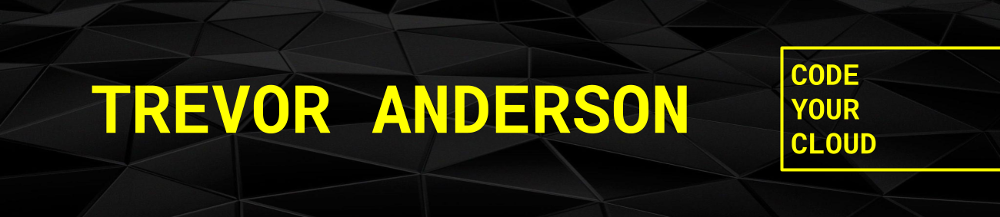
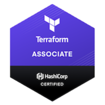

<!-- HEADER -->

<!-- SOCIAL MEDIA BUTTONS -->

  
  &nbsp;
  
  &nbsp;
  
  &nbsp;
  

<!-- INTRO -->

Hi there 👋,

I'm Trevor Anderson, cloud engineer and Founder of [**Nerdware**](https://github.com/Nerdware-LLC). Awesome applications in the modern world demand secure cloud infrastructure that drives both performance and scale - without wrecking your wallet. This is my passion - designing and building cloud architecture that helps people get things done.

> Check out my new [**YouTube Channel**](https://www.youtube.com/channel/UCguSCK_j1obMVXvv-DUS3ng) for helpful cloud-related How-To guides. Upcoming videos will cover how to **_code your cloud_** with Terraform, Terragrunt, Packer, Golang, CI/CD tools, and more.

---

### 🥇 Badges

  

  

---

### 🔧 Tech & Tools

#### Cloud

#### Back End

#### DevOps

#### CI/CD

#### Languages

-5835CC.svg?style=for-the-badge&logo=terraform&logoColor=white>)

#### Dev Tools

#### Frameworks, Platforms, & Libraries

#### Front End

#### Mobile

---

### 💬 Contact

Trevor Anderson - [@TeeRevTweets](https://twitter.com/teerevtweets) - [T.AndersonProperty@gmail.com](mailto:T.AndersonProperty@gmail.com)

  
  &nbsp;
  
  &nbsp;
  
  &nbsp;
  
    

[**_Dare Mighty Things._**](https://daremightythings.co/)

