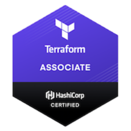

<!-- PROJECT HEADER -->

  <h1 align="center" style="margin: 0; padding: 0; border-bottom: none;">Hi 👋 I'm Trevor Anderson</h1>
  <strong style="font-size: 1.25rem; margin: 1rem 0 1.25rem 0;">Founder of <a href="https://github.com/Nerdware-LLC" >Nerdware</a></strong>

<!-- PROJECT SHIELDS GO HERE -->

  

[![pre-commit][pre-commit-shield]](https://github.com/pre-commit/pre-commit)

[![LinkedIn][linkedin-shield]][linkedin-url]

  

---

## My Badges

## Contact

Trevor Anderson - [@TeeRevTweets](https://twitter.com/teerevtweets) - T.AndersonProperty@gmail.com

[![LinkedIn][linkedin-shield]][linkedin-url]

<!-- MARKDOWN LINKS & IMAGES -->
<!-- https://www.markdownguide.org/basic-syntax/#reference-style-links -->

[pre-commit-shield]: https://img.shields.io/badge/pre--commit-enabled-brightgreen?logo=pre-commit&logoColor=white
[linkedin-url]: https://www.linkedin.com/in/trevor-anderson-3a3b0392/
[linkedin-shield]: https://img.shields.io/badge/LinkedIn-0077B5?logo=linkedin&logoColor=white
